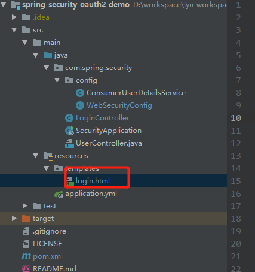
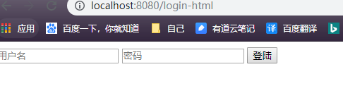
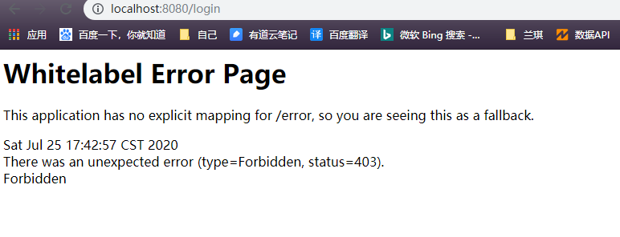

#  Spring Security 认证授权高级篇

## 1. 自定义认证

`Spring Security` 提供了非常好的认证方法, 比如: 快速上手将用户信息保存到内存中,实际开发中用户信息通常是放到数据库中,`Spring Security`   可以实现从数据库中读取用户信息,`Spring Security` 还支持多种授权方法.

###  1.1  自定义登陆页面

`Spring Security` 会根据启用的功能自动生成一个登录页面URL, 并使用默认`URL` 处理登陆的提交内容,登录i后跳转到默认的`URL`等,尽管自动生成的登陆页面很方便快速启动和运行,但大多数应用程序都希望定义自己的登录页面.

#### 1.1.1 添加`pom` 依赖

```xml
 <dependency>
            <groupId>org.springframework.boot</groupId>
            <artifactId>spring-boot-starter-thymeleaf</artifactId>
        </dependency>
```


#### 1.2 添加页面, 在项目的`resource/templates`下放入`login.html`页面

```html
<!DOCTYPE html>
<html lang="en">
<head>
    <meta charset="UTF-8">
    <title>登陆</title>
</head>
<body>

<div>

    <form action="/login" method="post">
        <input type="text" name="username" placeholder="用户名">

        <input type="password" name="password" placeholder="密码">
        <button type="submit">登陆</button>

    </form>

</div>
</body>
</html>

```

 

目录结构为:




#### 1.1.4 编写跳转逻辑 `LoginController`

```java
@GetMapping("/login-html")
    public String login() {

        return "login";
    }
```


#### 1.1.4  配置安全配置

我们在`WebSecurityConfig` 中修改

```java
    // 配置安全拦截机制
    @Override
    protected void configure(HttpSecurity http) throws Exception {

        http.authorizeRequests()

//                //访问/r/r1资源的 url需要拥有p1权限。
//                .antMatchers("/r/r1").hasAuthority("p1")
//                //访问/r/r2资源的 url需要拥有p2权限。
//                .antMatchers("/r/r2").hasAuthority("p2")
                .antMatchers("/r/**").authenticated()
                .anyRequest().permitAll()
                .and()
                .formLogin()  // (1)
                .loginPage("/")  // (2)
                .loginProcessingUrl("/login-html")  // (3)
                .successForwardUrl("/login‐success") // (4)
                .permitAll(); // (5)
    }
```

步骤介绍

1. 允许表单登陆
2.  指定我们自己的登陆页面, `Spring Security` 以重定向的方式跳转到`/`
3. 指定登陆处理的URL, 也就是用户名、密码表单提交的目的路径
4. 指定登陆成功后的跳转`URL`
5. 我们必须允许所有用户访问我们的登录页面(例如为验证的用户), 这个`formLogin().permitAll() ` 方法允许任务用户访问基于表单登陆的所有`URL`


#### 1.1.5  测试

当用户没有认证的时候,访问系统的资源就会重定向到`/login-html` 页面




当输入账号和密码, 点击登陆的时候，发现报错




**解决:**

`Spring Security` 为防止`CSRF``（Cross-site request forgery跨站请求伪造）` 的发生, 限制了除了`get` 以外的大多数方法. 

**解决方法1:**

屏蔽`CSRF`的控制, 即`Spring Security` 不再限制`CSRF`

配置  `WebSecurityConfig`

```java
  // 配置安全拦截机制
    @Override
    protected void configure(HttpSecurity http) throws Exception {

        http
                .csrf().disable() // //屏蔽CSRF控制，即spring security不再限制CSRF
            
            ....
```


**解决方法2:**

在`login`的页面,添加一个`token`,`Spring Security` 会验证`token`, 如果`token` 通过则可以继续请求. 

`login.html`

```html

    <form action="/login" method="post">
        <input type="hidden"  name="${_csrf.parameterName}"   value="${_csrf.token}"/>
        .....
```


