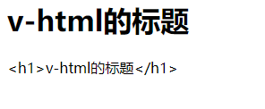

#  vue

Vue (读音 /vjuː/，类似于 **view**) 是一套用于构建用户界面的**渐进式框架**。与其它大型框架不同的是，Vue 被设计为可以自底向上逐层应用。Vue 的核心库只关注视图层，不仅易于上手，还便于与第三方库或既有项目整合。另一方面，当与[现代化的工具链](https://cn.vuejs.org/v2/guide/single-file-components.html)以及各种[支持类库](https://github.com/vuejs/awesome-vue#libraries--plugins)结合使用时，Vue 也完全能够为复杂的单页应用提供驱动。

`MVVM`思想

- `M`:`module` 包含数据和一些基本的操作
- `V`: `view`视图,页面渲染结果
- `VM`:`view-module`模型和视图间的双向操作

视图和数据通过`VM` 绑定起来,模型里面有变化会自动的通过`Directives` 填写到视图中,视图表单中添加了内容也会自动的通过`DOM Listeners` 保存到模型中

教程：https://cn.vuejs.org/v2/guide/

安装

- 直接下载并使用`<script>` 标签引入
- 或者直接在控制台使用`npm install vue`引入,
  - 先使用`npm init -y ` 初始化项目, 生成了一个`package.json` 文件,说明它是一个`npm` 管理的项目
  - `npm install vue`,安装后在项目`node_modules` 里就有了vue

测试

`index.html`

```html
<!DOCTYPE html>
<html>
	<head>
		<meta charset="utf-8">
		<title></title>
	</head>

	<body>
		<div id="app">

			<input type="text" v-model="num" />
			<button v-on:click="num++">点赞</button>
			<button v-on:click="cancle()">取消</button>
			<h1>{{name}}, 非常帅,有{{num}}人为他点赞{{hello()}}</h1>

		</div>

		<script src="./node_modules/vue/dist/vue.js"></script>
		<script>
			let vue = new Vue({ // 生成vue 对象

				el: "#app", // 绑定元素, id=app
				data: { //封装数据

					name: "张三",
					num: 0
				},
				methods: {

					// 取消点赞的方法
					cancle() {

						this.num--;

					},
					hello() {
						return "1";

					}
				}
			});
		</script>
	</body>


</html>

```


##  `v-text`和`v-html`指令

`v-text`指令会将绑定的内容安装文本进行展示

`v-html` 指令会将绑定的内容按照`html`元素进行展示

```html
<!DOCTYPE html>
<html>
	<head>
		<meta charset="utf-8">
		<title>演示vue的v-text和v-html指令的demo</title>
	</head>
	<body>
		<div id="app">

			<span v-html="html"></span>
			<span v-text="text"></span>
			</div<>
	</body>
	<script src="./node_modules/vue/dist/vue.js"></script>
	<script>
		let vue = new Vue({
			el: "#app",
			data: {

				html: "<h1>v-html的标题</h1>",
				text: "<h1>v-html的标题</h1>"
			},

			methods: {

			}
		});
	</script>
</html>

```

显示的内容为: 




## `v-bind` 指令

`v-bind` 指令用于动态的绑定一个或者多个`attribute` 中,